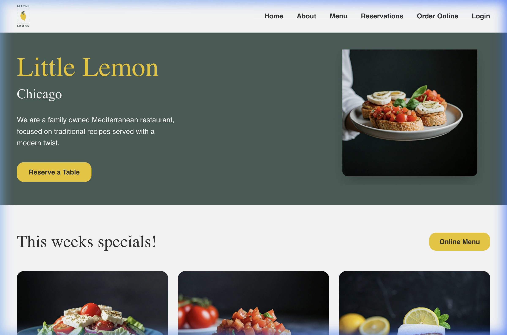
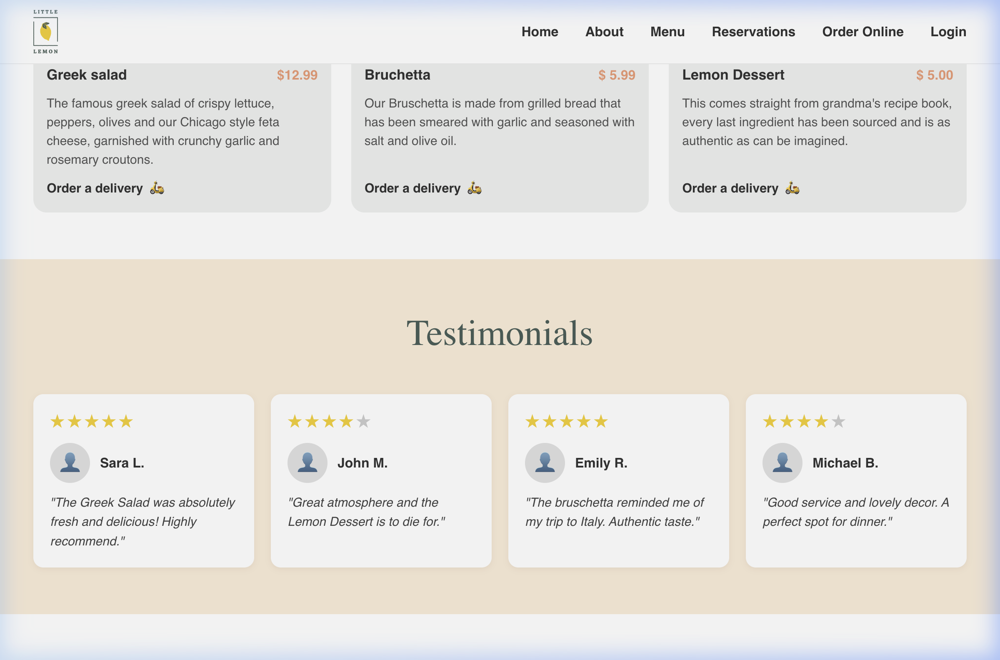
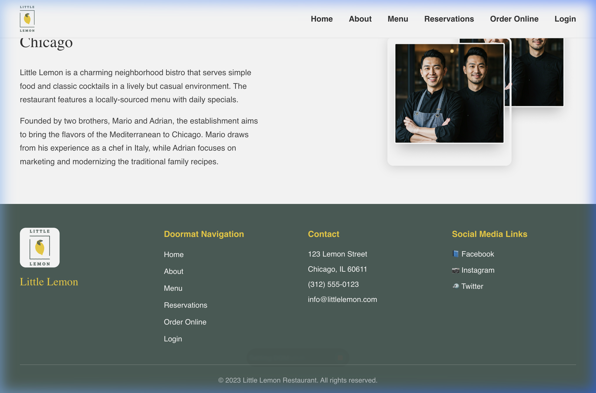
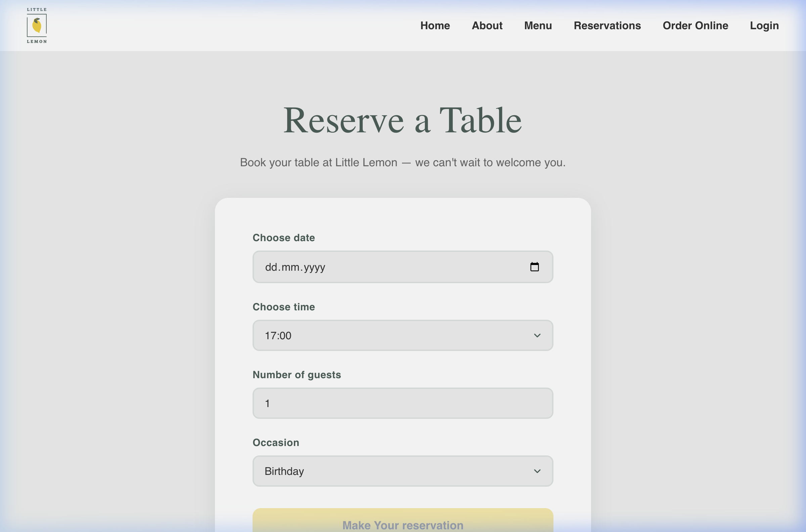

# 🍋 Little Lemon Restaurant - Capstone Project

This is the final Capstone Project for the **Meta Front-End Developer Professional Certificate** on Coursera. Little Lemon is a family-owned Mediterranean restaurant, focused on traditional recipes served with a modern twist.

## 🎯 Project Goals
The main objective was to apply all the skills learned throughout the Meta certification program, including UX/UI principles, React component architecture, robust testing, and complex state management.

## 🚀 Features
- **Table Reservation System:** A fully functional booking form where users can reserve a table by selecting a date, time, and number of guests.
- **Form Validation:** Comprehensive client-side validation using Formik and Yup.
- **API Integration:** Simulates fetching available reservation times and submitting bookings.
- **Responsive Design:** Optimized for mobile, tablet, and desktop views.
- **Specials & Testimonials:** Showcases weekly specials and real customer social proof.

## 📸 Screenshots

### Homepage - Hero Section


### Specials & Testimonials


### About & Restaurant Mission


### Table Reservation Page


## 🛠️ Tech Stack
- **Frontend:** React.js, Vite
- **Routing:** React Router v6
- **Testing:** Jest, React Testing Library, Vitest
- **Form Handling:** Formik & Yup
- **Styling:** CSS3

## ⚙️ How to Run Locally

1. **Clone the repository**:
   ```bash
   git clone https://github.com/alpgi1/little-lemon-capstone.git
   ```

2. **Navigate to the project directory**:
   ```bash
   cd little-lemon-capstone-project
   ```

3. **Install dependencies**:
   ```bash
   npm install
   ```

4. **Start the development server**:
   ```bash
   npm run dev
   ```

5. **Open your browser and navigate to**:
   `http://localhost:5173`

## 🧪 Testing

To run the unit and integration tests, use the following command:
```bash
npm run test
```

---
*Created by **Alpgiray Celik** as part of the Meta Front-End Developer Capstone project.*
